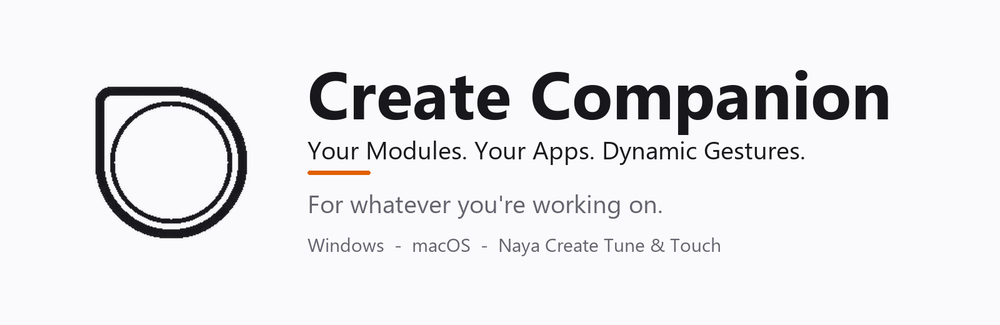
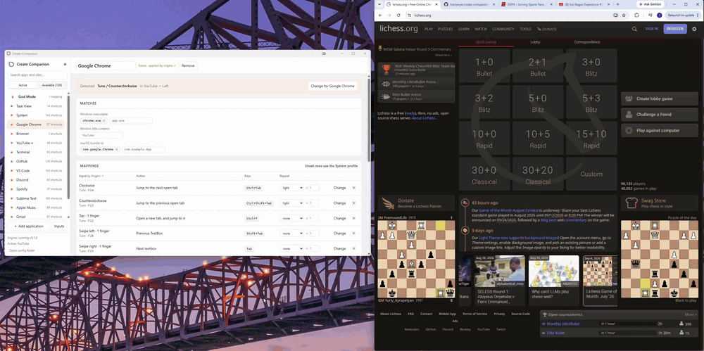
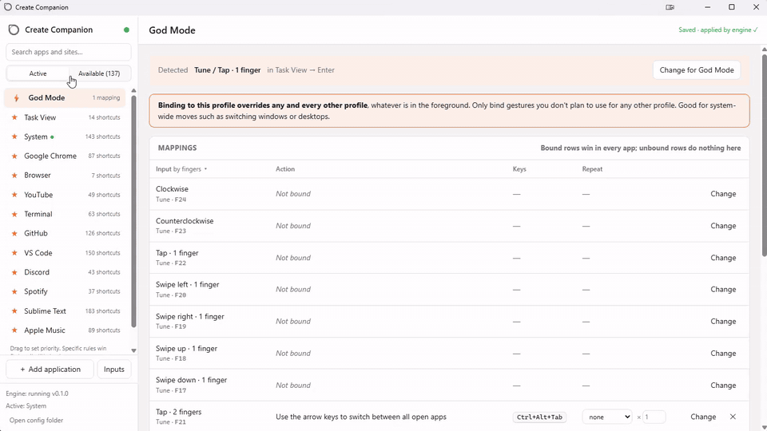

<p align="center">
  <picture>
    <source media="(prefers-color-scheme: dark)" srcset="docs/media/banner-dark.png">
    
  </picture>
</p>

<p align="center">
  <b>Your Modules. Your Apps. Dynamic Gestures.</b> For whatever you're working on.<br>
  Flash a Naya Create module once. Decide what its gestures do in each app, live, on the computer.
</p>

<p align="center">
  <a href="https://github.com/traviswye/create-companion/releases/latest"></a>
  <a href="https://github.com/traviswye/create-companion/releases"></a>
  
  <a href="LICENSE"></a>
</p>

<p align="center">
  <a href="https://github.com/traviswye/create-companion/releases/latest"></a>&nbsp;
  <a href="https://github.com/traviswye/create-companion/releases/latest"></a>
</p>

<p align="center"><a href="INSTALL.md">Install guide</a> · <a href="CHANGELOG.md">Release notes</a> · <a href="https://github.com/traviswye/create-companion/discussions">Discussions</a> · <a href="https://github.com/traviswye/create-companion/issues/new/choose">Report a bug or request an app</a></p>

<p align="center">
  
</p>

<p align="center"><i>One Tune, no reflashing: in Chrome a tap is "new tab" and the dial switches tabs. When the YouTube tab comes to the front, the same tap is play/pause and the dial seeks.</i></p>

## Highlights

| Feature | What it means for you |
|---|---|
| **Per-app profiles** | The dial means "next tab" in Chrome, "brush size" in Photoshop, "volume" on the desktop. Sites inside a browser get their own profile by window title. |
| **A catalog of 160+ apps and sites** | Pick actions by name ("Increase brush size") from 22,000+ documented shortcuts, filtered to your OS. Or record any key combination. |
| **Tune and Touch** | Dial, taps and swipes by finger count, with modifier namespaces so two modules share the same keys. Two-finger swipes can follow the swipe or fire once. |
| **Live configuration** | A configuration window that shows every gesture as it happens, saves as you edit, and never needs the module reflashed. |
| **God Mode and System** | Bindings that win everywhere (window switching, desktops) and a fallback for everything else. |
| **Windows and macOS** | One installer per platform, per-user, no admin. macOS ships as a universal Intel/Apple Silicon build. |

## How it works

```
 Tune / Touch  ──USB──►  Windows  ──►  Create Companion engine  ──►  the app in front
 (flashed once:            sees          F23 → "dial counter-clockwise"     receives Ctrl+Shift+Tab
  dial CCW = F23)          F23           Chrome is in front → Ctrl+Shift+Tab
```

1. **Inputs.** The module is flashed so each gesture sends one F-key (F13–F24), optionally with a
   modifier so two modules can share the same keys (Tune on plain keys, a Touch on Shift+keys).
   Create Companion intercepts only the keys you tell it about; everything else on the keyboard
   is untouched.
2. **Profiles.** A profile is a set of gesture → action bindings for one application or website.
   The engine picks the profile by the executable in the foreground, or by window title for a
   site inside a browser. **System** is the fallback for anything without a profile; **God Mode**
   holds bindings that win everywhere, whatever is in front (window switching, desktops).
3. **Actions.** A keyboard shortcut, a media key, mouse scroll, launching a program, or a shell
   command. A catalog of **162 applications, websites and systems with 22,646 documented
   shortcuts** lets you pick an action by name ("Next tab", "Increase brush size") instead of
   remembering the keys.

## Quick start

1. **Install** Create Companion ([INSTALL.md](INSTALL.md)). The engine starts and a dial icon
   appears in the tray.
2. **Flash the module.** Open the configuration window (tray icon → *Open configuration…*), go to
   **Inputs**, and check which key each gesture is expected to send. The defaults for a Tune are
   below. macOS has no F21–F24, so the Mac set stays within F13–F20:

   | Gesture | Windows | macOS |
   |---|---|---|
   | Dial clockwise / counter-clockwise | F24 / F23 | F20 / F19 |
   | Tap (1 finger) | F22 | F18 |
   | Swipe left / right / up / down (1 finger) | F20 / F19 / F18 / F17 | F17 / F16 / F15 / F14 |

   Add rows for any other gestures you use (2- and 3-finger taps and swipes, with a modifier if
   you like), then click **Export for OpenFlow…**. It writes one module-profile file per module;
   import that in OpenFlow and flash. Or flash the keys by hand in OpenFlow and use **Learn** on
   each row to capture what the module actually sends.
3. **Star some apps.** The left column's **Available** tab lists everything in the catalog with
   its shortcut count. Click a name to preview its shortcuts and the mappings it would set up;
   click the star to enable it. Starred profiles appear under **Active**.
4. **Try it.** Turn the dial with the configuration window open: the top of the page shows the
   gesture it detected, the profile it landed in and the action it ran, with a button to change
   it. Edits save automatically and the engine applies them within a second.

## The configuration window



- **Active / Available.** Active profiles are the ones in use. Drag them to set priority for
  the rare case where two profiles match the same window and are equally specific; a site title
  always beats an app, and an app naming one executable beats a group naming several. God Mode
  is pinned at the top; System is the fallback.
- **Mappings.** One row per input: the plain-English action, the keys it sends, and the
  **Repeat** column: a speed curve for the dial (turn faster, repeat more) and a multiplier
  (actions per detent). Rows an app doesn't bind fall through to System; rows God Mode binds are
  locked everywhere else.
- **Action picker.** The app's own documented shortcuts, the generic catalog by category, a
  recorded shortcut (press the keys; it is named automatically when the catalog knows it),
  media keys, scroll, launch a program, run a command, or "do nothing" to silence a gesture in
  one app.
- **This computer / All platforms.** The catalog is filtered to what runs on this OS. Switch to
  All platforms to see macOS entries and chords too, for example to build a configuration you
  will move to a Mac.
- **Inputs.** Which key and modifier each gesture sends, per finger count; Learn; Export for
  OpenFlow. Some gestures arrive as a *run* of keys scaled to how far the fingers travel: the
  Tune's two-finger swipes, and on a Touch the two-finger scroll in any direction and the
  four-finger swipes up and down. By default a run is collapsed to one action, and the **Follow swipe** switch (per input,
  and per binding in each profile) lets an action such as volume or scroll follow the swipe's length
  instead.
- **Messages you may see.** *Received Shift+F16 from the keyboard, but no input uses it*: the
  module sent a key you have not added under Inputs; the button prefills the add row.
  *Detected … but nothing is bound for it*: the gesture is known but the active profile and
  System have no action for it; the button opens the picker.

## Files

| What | Where |
|---|---|
| Configuration (TOML, hot-reloaded) | `%APPDATA%\CreateCompanion\config.toml` |
| Logs | `%LOCALAPPDATA%\CreateCompanion\logs\` |
| Installed programs (per-user install) | `%LOCALAPPDATA%\Create Companion\` |

The configuration file is plain TOML and safe to edit by hand; the engine reloads it on save and
keeps the previous version if the new one fails to parse. Older files are migrated on load and
the original kept next to them as `config.backup-v<N>.toml`.

## Command line

```
create-companion                     tray + engine (the normal way; the installer starts this)
create-companion --no-tray           console mode, Ctrl+C to quit
create-companion --config x.toml     use another configuration file (still hot-reloaded)
create-companion --print-config      dump the bundled default configuration
create-companion --allow-injected    treat synthetic F-keys as gestures (testing without a device)
```

## Building from source

Requirements: Rust (stable, MSVC toolchain), Node.js 22, and on Windows the Visual Studio Build
Tools. Python 3 for the catalog scripts.

```powershell
cargo test                         # engine + core
cargo clippy --all-targets
cd ui; npm ci; npm run build; cd ..
cargo build --release -p create-companion -p create-companion-ui --features create-companion-ui/custom-protocol
target\release\create-companion.exe
```

The engine looks for `create-companion-ui.exe` next to itself, so build both into the same
`target` directory as above. Close a running engine and window before building: the UI build copies
the engine in as its sidecar and both builds replace the running executables.
`powershell -File tools\build_installer.ps1` produces the installer.

### Repository layout

| Path | Role |
|---|---|
| `crates/companion-core` | OS-independent logic: gestures, inputs, profiles, actions, acceleration, configuration, chord parsing. Unit-tested. |
| `crates/companion-platform` | Per-OS glue. Windows: low-level keyboard hook, foreground watch, `SendInput`. macOS: CGEvent tap, NSWorkspace, CGEvent posting, LaunchAgent. The hook's decision logic is shared. |
| `crates/companion-engine` | The `create-companion` executable: pipeline, config watcher, tray, IPC to the window, logging. |
| `ui/` | The configuration window: Tauri 2 shell (`ui/src-tauri`) and Vite/React frontend (`ui/src`). |
| `catalog/` | One JSON file per application, website or system with its documented shortcuts; `catalog/README.md` has the format, `catalog/REPORT.md` the per-entry notes. |
| `presets/` | Generated from `catalog/` by `tools/gen_presets.py`: the app catalog, the generic action list and the default configuration. |
| `tools/` | Catalog generator and validator, icon generator, installer build, and capture tools for studying what a module sends: `input_capture.ps1` logs every keyboard and mouse event from a stock-profile module, `gesture_capture.ps1` counts F-keys from a flashed one, `keymon.ps1` is a raw key monitor, and `input_analyze.py` / `keymon_analyze.py` read their logs; gesture plans live in `tools/plans/`. |

### Adding an application to the catalog

Create `catalog/<id>.json` following `catalog/README.md` (match rules, sources, the documented
shortcut list, optional default Tune bindings), run `python tools/validate_catalog.py` and
`python tools/gen_presets.py`, and open a pull request. Shortcut lists come from the vendor's
documentation; every entry cites its sources.

## Roadmap

- **Shipped**: Windows and macOS engines with the same configuration window; the 160+ entry
  catalog; Tune and Touch inputs with modifier namespaces; God Mode and System; per-OS
  filtering; installers and a tag-driven release workflow.
- **Next**: code signing and notarization once an Apple Developer certificate and a Windows
  certificate exist, so installs stop needing the SmartScreen and Gatekeeper workarounds; more
  Touch fields as OpenFlow exposes them.
- **Later**: Linux.

Design notes and the phase checklist are in `docs/PLAN.md`; the original scope document is
`docs/scope.md`.

## License

MIT. Shortcut data in `catalog/` is compiled from public vendor documentation with sources cited
in each file; the ShortcutMapper import in `reference/` is MIT (see `reference/ATTRIBUTION.md`).
